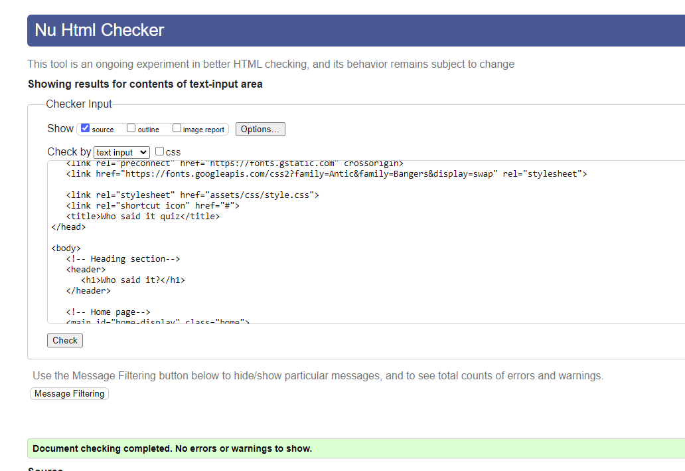

# Who said it? Quiz
<!-- code to make layout demo from https://ui.dev/amiresponsive -->

Site link: <a href="https://sarahliz24.github.io/Who-said-it/" target="_blank">Who said it?</a>
---
# TABLE OF CONTENTS

1. [Introduction](#introduction)
2. [User Experience](#user-experience)
    1. [User Stories](#user-stories)
3. [Design](#design)
    1. [Colour Scheme](#colour-scheme)
    2. [Typography](#typograhy)
    3. [Wireframes](#wireframes)
4. [Current Features](#features)
    1. [Header](#1-header)
    2. [Home Display](#2-home-display)
    3. [Rules Display](#3-rules-display)
    3. [Game Display](#4-game-display)
    4. [End Page](#5-end-page)
5. [Future Features](#future-features)
6. [Testing](#testing)
    1. [Validator Testing](#validator-testing)
    2. [Manual Testing](#manual-testing)
7. [Accessibility](#accessibility)
8. [Bugs](#bugs)
    1. [Known Bugs](#known-bugs)
    2. [Solved Bugs](#solved-bugs)
9. [Deployment](#deployment)
10. [Credits](#credits)
    1. [Code Used](#code-used)
    2. [Content](#content)
    3. [Technologies Used](#technologies-used)
    4. [Media](#media)
11. [Acknowledgements](#acknowledgements)

# INTRODUCTION

This website presents an interactive quiz game, focused on celebrity quotes. It is designed to be a fun distraction from the grind of daily life for the user, including a bright and fun pop-art grahphical style, humorous questions, cheeky feedback comments to entertain at the end, and the ability for the to replay the game.

# USER EXPERIENCE

## User Stories

### New User

As a new user I want to:

 * Understand the purpose of the site quickly to see if I want to play
 * Understand the tone of the site quickly to see if I want to play
 * Be able to navigate around the site intuitively to enjoy the game
 * Easily access the rules of the game if I need to understand how to play
 * Have feedback on where I am in the quiz so I know how far through I am
 * Have feedback on my score as I progress so I know if I'm succeeding (or not)
 * Have feedback if I've forgotten to answer a question so I don't an opportunity to increase my score
 * Have feedback at the end of the quiz so I know how well I did
 * Easily replay the quiz so I can enjoy different funny questions
 * Easily replay the quiz so I can try to get a better score

### Returning User

As a returning user I want to:

* Be able to use the site on any device so that I can play the game anywhere
* Easily replay the quiz so I can enjoy different funny questions
* Easily replay the quiz so I can try to get a better score each time

---

# DESIGN

## Colour scheme

Colour scheme

    

The colour scheme was chosen to tie in the with game ethos of being bright and fun, with a pop-art style.  A bright, contrasting colour palatte was selected, and then the yellow colour was manually edited to match the yellow from the background image, for a cohesive look.

The colours chosen were:
* Palatinate Blue #0043DE 
* Poppy #DF2935
* Sunglow #FDCA40
* Platinum #E6E8E6

## Typograhy

The primary font, used for the site heading, buttons and warnings, is Bangers. This is a fun pop-art style font that reflects the site ethos. A default font of cursive was set as this will still reflect the fun ethos of the site in case Bangers cannot be loaded.

The secondary font used is Antic, which is a clear and easy to read sans-serif font, that visually pairs well with the primary font. This is used for text areas of the game, such as questions, answers, results feedback and the rules section, to ensure these areas are easy to read for the user.

## Imagery

Background image

    

The background is set to a simple black and yellow image of repeating question marks.  This helps the user to quickly identify the purpose of the site (i.e. a quiz), and fits with the bright pop-art theme.  A background colour of Sunglow #FDCA40 (from the above colour palette) was added as the default background in case the image does not load, in order to maintain the colour scheme of the site, if needed.

## Wireframes

Wireframes for the project are below.  Mobile and desktop wireframes were produced using Balsamiq.  Final product is consistent with the intention and design of the wireframe designs.

 

Home Page Mobile

    

Home Page Desktop

    

Game Page Mobile

    

Game Page Desktop

    

End Page Mobile

    

End Page Desktop

    

---

# CURRENT FEATURES

## 1. Header

Header

    

The header "Who said it" is displayed at the top of the screen, making it easily visible.  The header is visible during all sections of game play, providing consistency to the site

## 2. Home Display

### Intro Box

Intro Box

    

* The intro box is styled in a consistent manner to all other user information text boxes, with a yellow background, white border, and blue text - this helps make it clear to users these boxes are for information and are not integral to game play
* The box explains, in the cheeky tone of the game, that it is a time-wasting quiz about celebrity sayings, making the game's purpose clear to the user

Let's Play Button

    

* Beneath the intro box, is the let's play button
* This button is styled with red text, to draw the user eye
* It has a white background, and blue border, which is consistent with the play again button on the final page, providing a consistent 'play the game' cue to the user
* The white background is also consistent with the white background used in the question and answer boxes, also providing consistency to the user with regards to game play sections
* On mouse hover the button text changes from red to blue, and the border changes from blue to red, letting the desktop user know they are about to select the button
* When selected, the button takes the user into the game, loading the first question and welcome text

### Rules Display

Rules button

    

* Beneath the let's play button is the rules button - this is styled with a yellow background and blue/white border
* The button style is consistent with the go back button in the rules section, providing a visual link to the two buttons and their association with the rules
* On mouse hover the button text changes from red to blue, and the border changes from blue to red, letting the desktop user know they are about to select the button
* The button is beneath the let's play button so it can be ignored by either a user who is confident to play without advice, or by the returning user

Rules display

    

* Clicking the rules button displays the rules section to the user
* This provides a short description of game play and lets the user know how many questions will be asked
* It also contains a cheeky quip consistent with the game ethos

go back button

    

* The go back button takes the user back to the intro page when clicked
* It's styling and hover effect is the same as the rules button for consistency

## 3. Game Display

Welcome Message

    

* The welcome display box is yellow with blue text, consistent with all information text boxes across the game
* For the first question it displays text welcoming the player, and invites them to click a button to start playing - this acts as a prompt for a user who unsure how to proceed with play

Question Box

    

* Game questions are displayed in red text to draw the users eye.
* The question box has a white background to emphasise it is an important area of game play (consistent across the game with other game play areas/buttons)

Answer Boxes

    

* The answer boxes are displayed with blue text, to differentiate them clearly from the question area
* The user can click on one box only to answer, and after an answer is selected all other answers options cannot be selected (remaining locked until the next question is loaded)
* If a user is correct the box will turn green for a short period
* Textual feedback is given to the user in the tracker box, where 'CORRECT' is displayed
* Score feedback is also given to the user as the score increments in the tracker (information) box at the top of the page e.g. "Your score is now 1 out of 10"
* If a user is wrong the box will turn red for a short period
* Textual feedback is given to the user in the tracker box, where 'WRONG' is diplayed
* Score feedback is also given to the user as the score does not increment in the tracker (information) box at the top of the page e.g. "Your score is now 0 out of 10"

Next Button

    

* Beneath the answer options is the next question button - this is styled with a yellow background and blue/white border. The button style is consistent with the go back and rules buttons 
* When selected a new question and answer set loads for the user
* On mouse hover the button text changes from red to blue, and the border changes from blue to red, letting the desktop user know they are about to select the button
* The button is beneath the answer options to provide a logical flow of game play execution to the user

Reminder Alert

    

* If the user does not select an answer, and clicks the next button (an unexpected event) a reminder alert is displayed, overlaying the question/answer area
* The reminder stays active long enough for the user to notice it, but not long enough to impede game play or annoy the user
* The reminder will re-activate each time the user clicks the next button without selecting an anwser

Go To Results Button

    

* One the last question, the next button changes to a go to results button
* This is a visual cue to the user that they are on the last question
* This is styled with a yellow background and blue/white border - the button style is consistent with the next button, go back and rules buttons 
* When selected the game questions/answers disappear and the outro display is shown
* On mouse hover the button text changes from red to blue, and the border changes from blue to red, letting the desktop user know they are about to select the button
* The button is beneath the answer options to provide a logical flow of game play execution to the user

## 4. End Page

Outro Box

    

* The outro box is styled in a consistent manner to all other user information text boxes, with a yellow background, white border, and blue text - this helps make it clear to users these boxes are for information and are not integral to game play
* The user final score is displayed, along with cheecky quip in the tone of the game
* If the user scores 4 or less, the message reads: "You tried hard, but you really need to brush up on your celebrity knowledge!!" and "Thanks for playing"
* If the user scores 5 or 6, the message reads: "You were decidedly average, maybe playing again will help??" and "Thanks for playing"
* If the user scores 7 or more, the message reads: "Wow, you really know a lot of useless facts about celebrities - can you prove you're really great by scoring so high again??" and "Thanks for playing"

Play Again Button

    

* Beneath the outro box, is play again button
* This button is styled with red text, to draw the user eye
* It has a white background, and blue border, which is consistent with the let's play button on the first page, providing a consistent 'play the game' cue to the user
* The white background is also consistent with the white background used in the question and answer boxes, also providing consistency to the user with regards to game play sections
* On mouse hover the button text changes from red to blue, and the border changes from blue to red, letting the desktop user know they are about to select the button
* When selected, the button takes the user directly into the first question of a new game, resetting all game parameters

Go Home Button

    

* Beneath the play again button is the go home button
* This is styled with a yellow background and blue/white border - the button style is consistent with the next button, go back and rules buttons 
* On mouse hover the button text changes from red to blue, and the border changes from blue to red, letting the desktop user know they are about to select the button
* When selected, the button takes the user back to the home page, refreshing the page, and resetting all game parameters

# Future Features

## Leaderboard
* Implementation of a leaderboard where user can enter their name, and leaderboard displays top five user scores
* Addition of futher question sets to the questions array to increase value of user re-play

# TESTING

## Validator Testing

The code was regularly tested using W3c validators for HTML and CSS throughout development, and passed both tests on final testing.
<a href="https://validator.w3.org/#validate_by_input" target="_blank">W3C HTML Validator</a>
<a href="https://jigsaw.w3.org/css-validator/" target="_blank">W3C CSS Validatorit?</a>

### HTML final testing results:

HTML validation

    

### CSS final testing results:

HTML validation

    

 
## Lighthouse testing

* Lighthouse testing was conducted at regular intervals during development, using the Lighthouse function inbuilt into the Chrome Inspector tool
* 100% gained for Accessibility, Best Practises & SEO
* 89% gained for Performance - this could have been improved by using an avif file type for the background image, however it was decided to use jpg as this is compatible with the Edge broswer (and avif is not, which would have resulted in the default background for Edge users, decreasing chance of a positive visual game experience for the Edge user)

### Lighthouse final testing results:

Home Page

    

About Page

    

## Responsiveness Testing

* All responsive testing performed as expected
* Responsiveness was specifically tested during development, and at final testing, using Chrome and Firefox development responsive tools with a wide variety of screen sizes
* The Responsive Design Checker website was also used to test for responsiveness <a href="https://responsivedesignchecker.com/" target="_blank">Responsive Design Checker</a>
* Testing was also successfully performed on the following devices:
    * Huawei P20 Pro
    * Samsung Galaxy S22 Ultra
    * Microsoft Surface Pro 7
    * Acer desktop with HP 24 inch HD monitor
    * HP Notepad

## Accessibility testing

Wave Testing

    

Accessibility testing was performed regularly throughout development utilising 'WAVE Web Accessibility Evaluation Tools' <a href="https://wave.webaim.org/" target="_blank">WAVE Testing</a>

* Early development WAVE testing highlighted a contast issue between the text and the background (i.e. contrast difference too low).  To solve this without significantly changing the visual look of the game the background of the text boxes was changed have a background colour that matched the background image, and was set to an opacity of 0.9.  This allowed the background image to still be visible but provided enough background contrast with the text to achieve a high contrast rating on further WAVE testing.

## Browser Compatibility Testing

The site was successfully tested (i.e. no errors identified) on the following broswers to ensure intended functionality:

* Mozilla Firefox Version 109.0 (64-bit)
* Google Chrome Version 109.0.5414.120 (Official Build) (64-bit)
* Microsoft Edge Version 109.0.1518.70 (Official build) (64-bit)

* Chrome and Edge both return one console warning - Error with Permissions-Policy header: Origin trial controlled feature not enabled: 'interest-cohort'. This is related to git hub adding a header-set to all pages and can be ignored  <a href="https://github.blog/changelog/2021-04-27-github-pages-permissions-policy-interest-cohort-header-added-to-all-pages-sites/" target="_blank">Git Hub Blog</a>
* Firefox returns one console warning - "downloadable font: gasp: Changed the version number to 1 (font-family: "Antic" style:normal weight:400 stretch:100 src index:0)".  This does not affect site functionality.

## Device Testing

Manual testing was performed successfully (i.e. no issues identified) using the following devices:

* Huawei P20
* Samsung Galaxy S22 Ultra
* Microsoft Surface Pro 7
* Acer desktop with HP 24 inch HD monitor
* HP Notepad

## Manual Testing

The following features were manually tested on all mentioned browsers and devices, and found to be functioning as expected in each test case:

* Intro section
    * Page loads as expected
    * Header is displayed at top of page
    * All boxes and buttons are visible and active
    * Yellow opaque boxes are more intensely coloured on Firefox, however this does not detract from the visual design
    * Mouse hover effect for let's play and rules button working
    * Rules button operates correctly, taking user to rules section
    * Let's play button operates as expecting, taking user to first question of the game
    * When page is expanded wider than 700px the intro box stays the same size, keeping the intro area suitably compact in a larger view space
    * Background image displays as expected
    * Fonts load as expected

* Rules section
    * Page loads as expected
    * Header is displayed at top of page
    * Rules box and button are visible and working correctly
    * Mouse hover effect for buttons working
    * When page is expanded wider than 700px the intro box stays the same size, keeping the intro area suitably compact in a larger view space
    
* Game section
    * Page loads as expected
    * Header is displayed at top of page
    * All boxes and buttons are visible and active
    * Yellow opaque boxes are more intensely coloured on Firefox, however this does not detract from the visual design
    * Mouse hover effect for next question button working
    * Next question button operates correctly, taking user to new question
    * When page is expanded wider than 700px the intro box stays the same size, keeping the intro area suitably compact in a larger view space
    * Background image displays as expected
    * Fonts load as expected
    * Answer boxes respond well to re-sizing, either in column (for very small devices), 2x2 format, or row format, as expected
    * Correct answer displays green box for a set time, score increments correctly, CORRECT text displays to user
    * Wrong anwer displays red box for a set time, score does not increment, WRONG text displays to user
    * When user selected button without choosing an answer, reminder display is shown for set time, as expected
    * When user selects next question button next question is loaded
    * Game play progresses smoothly and as expected throughout the set of questions

* End section
    * Page loads as expected
    * Header is displayed at top of page
    * All boxes and buttons are visible and active
    * Yellow opaque boxes are more intensely coloured on Firefox, however this does not detract from the visual design
    * Mouse hover effect for buttons is working
    * When page is expanded wider than 700px the intro box stays the same size, keeping the intro area suitably compact in a larger view space
    * Background image displays as expected
    * Fonts load as expected
    * Correct final score and associated text display to user
    * Wrong anwer displays red box for a set time, score does not increment, WRONG text displays to user
    * Play again button operates correctly, taking user to a new set of questions (i.e. a new question 1)
    * Go home  button operates correctly, taking user to home page

* Re-play
    * Play again button operates correctly, taking user to a new set of questions (i.e. a new question 1)
    * Questions and score reset
    * Welcome message is displayed to user on tracker
    * Game play progresses smoothly and as expected throughout the set of questions

## Accessibility

* Early development WAVE testing highlighted a contast issue between the text and the background (i.e. contrast difference too low).  To solve this without significantly changing the visual look of the game the background of the text boxes was changed have a background colour that matched the background image, and was set to an opacity of 0.9.  This allowed the background image to still be visible but provided enough background contrast with the text to achieve a high contrast rating on further WAVE testing.
* All areas of the game are able to be used using the same input method
* Game controls are as simple as possible
* Game can be started directly from the landing page
* Answer feedback is given to user both via colour in the question box, and also via textual correct/wrong feedback in the tracker section (above the questions)
* User can progress through questions at their own pace

# BUGS

## Known bugs
* THere are no known bugs at present

## Solved bugs
1. During early testing it was identified that the game was recording the selected user answer twice with a single user selection (e.g. mouse click), which was then incrementing the score x2
 To fix: checked console log, noted same rountine was running more than once (scoreTracker); identified that startGame function was called at incorrect point in game, removed this and score then incrementing correctly
 2. During early testing it was found that questions were repeating within a single game.  I had written a randomiser function to deal with this, however it was not working as intended, and I changed it to a single code line splicing the question array after each question, which was effective in solving the issue.
---

# Deployment

This site was deployed using Github as follows:

1. Enter the relevant Github repository
2. Select **Settings** from the ribbon menu
3. Go to **Pages** (within the **Code and Automation** section) on the left-side menu
4. Within the **Build and deployment** section:
    * Select **Deploy from a branch** from the **Source** drop-down menu
5. Ensure the branch is set to **main** and choose **root** from the adjacent drop-down boxes
6. Select **Save**
7. Site link will be displayed in a box towards the top of the page 
    * It can take a few minutes on initial deployment for the link to display

This site can be forked using Github as follows (to make a copy in your own repository):

1. Enter the relevant Github repository
2. Go to **Fork** button on the right-side ribbon menu (between **Unwatch** and **Star**)
3. Click the button to make a copy automatically into your own respository
4. **Owner** will default to your own github name
5. Add a repository name and an optional  
6. Select **Create Fork** button

This site can be cloned using Github as follows (to make a copy on your own machine):

1. Enter the relevant Github repository
2. Click the green **Code** from the menu (to the left of the green **Gitpod** button)
3. Copy the link under https (to copy using HTTPS)
4. Open git bash on your own machine, and select the directory you want to save into
5. Type 'git clone' then copy in your link
6. Press the enter key

The site github link is here: <a href="https://sarahliz24.github.io/Who-said-it/" target="_blank">Who said it?</a>
---

# CREDITS

## Code used
* How to apply spread syntax (for the question array) is based on information from https://developer.mozilla.org/en-US/docs/Web/JavaScript/Reference/Operators/Spread_syntax
* How to add an event listener to a loop is from the 'ES6 to the rescue' section of this stackoverflow page https://stackoverflow.com/questions/17981437/how-to-add-event-listeners-to-an-array-of-obj
* How to add a timer delay is from bobbyhadz.com https://bobbyhadz.com/blog/javascript-hide-element-after-few-seconds
* How to change the opacity by converting #fdca40 to rgba & selecting correct rgba settings; https://www.geeksforgeeks.org/set-the-opacity-only-to-background-color-not-on-the-text-in-css
* How to apply 'forEach' to any array was influenced by MDN Web Docs: https://developer.mozilla.org/en-US/docs/Web/JavaScript/Reference/Global_Objects/Array/forEach
    
## Content
* Written content for this site (apart from the quiz questions) was created by the site author
* Quiz questions are fropm nextluxury.com: <a href="https://nextluxury.com/funny/funny-celebrity-quotes/" target="_blank">Next Luxury</a>
	
## Technologies Used

During the creation of this site I used the following technologies:

* Github - used for online programming, change tracking and storage respository for this project
* Google fonts - used to search and download fonts applied to project
* Balsamiq - used for creating the wireframes in the project development phase
* RGBA color picker - used to convert coloors hex colours into rgba in order to set opacity on background of boxes <a href="https://rgbacolorpicker.com/hex-to-rgba" target="_blank">RGBA color picker</a>
* Coolors website  -used to select and modifycolour palatte <a href="https://coolors.co" target="_blank">Coolors</a>

## Media

* Images
	* Background image is from Freepik.com <a href="https://www.freepik.com/free-vector/hand-drawn-question-mark-pattern_26539472.htm#query=question%20pattern&position=4&from_view=keyword&track=ais">Freepik</a>
    * The reponsive design layout picture was created using Am I Responsive <a href="https://ui.dev/amiresponsive" target="_blank">Am I Responsive</a>

* Typography
    * Google fonts - Open Sans and Montserrat
---

# Acknowledgements

Thanks to my mentor Maranatha Ilesanmi who provided me with the support and advice to get the required work done.
Also thanks to Code Institute tutor support who helped me to untangle my thinking when I was trying to understand how to apply the acceptingAnswers concept.