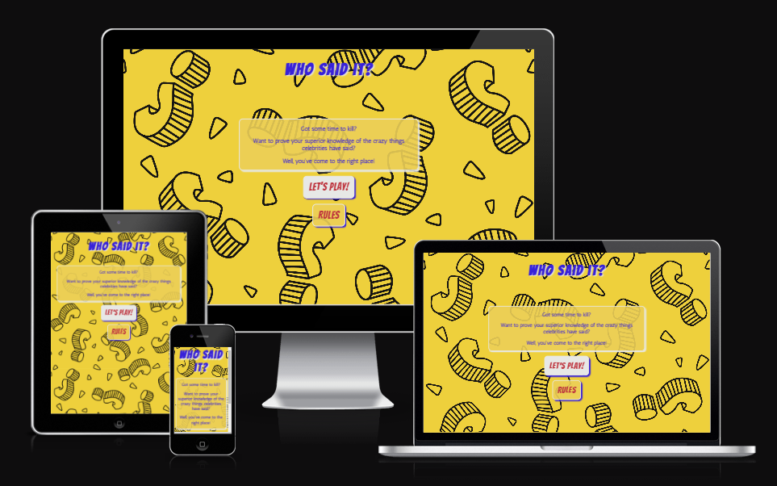
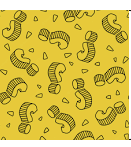

# Who said it? Quiz
<!-- code to make layout demo from https://ui.dev/amiresponsive -->

Site link: <a href="https://sarahliz24.github.io/Who-said-it/" target="_blank">Who said it?</a>
---
# TABLE OF CONTENTS

1. [Introduction](#introduction)
2. [User Experience](#user-experience)
    1. [User Stories](#user-stories)
3. [Design](#design)
    1. [Colour Scheme](#colour-scheme)
    2. [Typography](#typograhy)
    3. [Wireframes](#wireframes)
4. [Current Features](#features)
    1. [Header and Navigation Bar](#1-header-and-navigation-bar)
    2. [Hero image](#2-hero-image)
    3. [Services section](#3-services-section)
    5. [About Page](#5-about-page)
    6. [Resources Page](#6-resources-page)
    7. [Contact Page](#7-contact-page)
5. [Future Features](#future-features)
6. [Testing](#testing)
    1. [Validator Testing](#validator-testing)
    2. [Manual Testing](#manual-testing)
7. [Accessibility](#accessibility)
8. [Bugs](#bugs)
    1. [Known Bugs](#known-bugs)
    2. [Solved Bugs](#solved-bugs)
9. [Deployment](#deployment)
10. [Credits](#credits)
    1. [Code Used](#code-used)
    2. [Content](#content)
    3. [Technologies Used](#technologies-used)
    4. [Media](#media)
11. [Acknowledgements](#acknowledgements)

# INTRODUCTION

This website presents an interactive quiz game, focused on celebrity quotes. It is designed to be a fun distraction from the grind of daily life for the user, including a bright and fun pop-art grahphical style, humorous questions, cheeky feedback comments to entertain at the end, and the ability to replay.

# USER EXPERIENCE

## User Stories

### New User

As a new user I want to:

 * Understand the purpose of the site quickly to see if I want to play
 * Understand the tone of the site quickly to see if I want to play
 * Be able to navigate around the site intuitively to enjoy the game
 * Easily access the rules of the game if I need to understand how to play
 * Have feedback on where I am in the quiz so I know how far through I am
 * Have feedback on my score as I progress so I know if I'm succeeding (or not)
 * Have feedback if I've forgotten to answer a question so I don't an opportunity to increase my score
 * Have feedback at the end of the quiz so I know how well I did
 * Easily replay the quiz so I can enjoy different funny questions
 * Easily replay the quiz so I can try to get a better score

### Returning User

As a returning user I want to:

* Be able to use the site on any device so that I can play the game anywhere
* Easily replay the quiz so I can enjoy different funny questions
* Easily replay the quiz so I can try to get a better score each time

---

# DESIGN

## Colour scheme

Colour scheme

    

The colour scheme was chosen to tie in the with game ethos of being bright and fun, with a pop-art style.  A bright, contrasting colour palatte was selected, and then the yellow colour was manually edited to match the yellow from the background image, for a cohesive look.  

The colours chosen were:
* Palatinate Blue #0043DE 
* Poppy #DF2935
* Sunglow #FDCA40
* Platinum #E6E8E6

## Typograhy

The primary font, used for the site heading, buttons and warnings, is Bangers. This is a fun pop-art style font that reflects the site ethos. A default font of cursive was set as this will still reflect the fun ethos of the site in case Bangers cannot be loaded.

The secondary font used is Antic, which is a clear and easy to read sans-serif font, that visually pairs well with the primary font. This is used for text areas of the game, such as questions, answers, results feedback and the rules section, to ensure these areas are easy to read for the user.

## Imagery

Background image

    

The background is set to a simple black and yellow image of repeating question marks.  This helps the user to quickly identify the purpose of the site (i.e. a quiz), and fits with the bright pop-art theme.  A background colour of Sunglow #FDCA40 (from the above colour palette) was added as the default background in case the image does not load, in order to maintain the colour scheme of the site, if needed.

## Wireframes

Wireframes for the project are below.  Mobile and desktop wireframes were produced using Balsamiq.  Final product is consistent with the intention and design of the wireframe designs.

 

Home Page Mobile

    

Home Page Desktop

    

Game Page Mobile

    

Game Page Desktop

    

End Page Mobile

    

End Page Desktop

    

---

# CURRENT FEATURES

## 1. Header

Header

    

The site name, cancer ribbon, and navigation bar are present and consistent at the top of all four site pages.

The cancer ribbon next to the group name quickly and easily identifies the page as relating to cancer, re-inforcing the reason the user visits the page.

The group name is simple and clear, making it easy for the user to identify the overall purpose of the site when on each page.

The navigation menu provides links to each of the four site pages. It clearly indicates which page the user is currently on, what each page is about, and allows the user to easily navigate around the site at all times without having to leave the page space. The navigation link is bold, with underlining removed, to clearly display to the user which page is currently active.

## 3. Game Section

Game Section

    

## 5. Result Section (End Page)

The about page is split into two sections:

Results Section

    

## Future Features

### Leaderboard

# TESTING

## Validator Testing

The code was regularly tested using w3c validators for HTML and CSS throughout development, using these links:
[W3C HTML Validator](https://validator.w3.org/#validate_by_input); [W3C CSS Validator](https://jigsaw.w3.org/css-validator/)

### HTML final testing results:

HTML validation

    

### CSS final testing results:

CSS Validation

    

 
## Lighthouse testing

Lighthouse testing was conducted at regular intervals during development, using the Lighthouse function inbuilt into the Chrome Inspector tool.

### Lighthouse final testing results:

Home Page

    

About Page

    

Resources Page

    

## Accessibility testing

Accessibility testing was performed regularly throughout development utilising 'WAVE Web Accessibility Evaluation Tools', using this link: [WAVE Testing](https://wave.webaim.org/)

This testing provided assistance on ensuring relevant issues were identified and resolved during development:
* 

 
 

Home Page

    

### Browser Compatibility Testing

The site was successfully tested (i.e. no issues identified) on the following broswers to ensure intended functionality:

* Mozilla Firefox Version 109.0 (64-bit)
* Google Chrome Version 109.0.5414.120 (Official Build) (64-bit)
* Microsoft Edge Version 109.0.1518.70 (Official build) (64-bit)

### Device Testing

Manual testing was performed successfully (i.e. no issues identified) using the following devices:

* Huawei P20
* Samsung Galaxy S22 Ultra
* Microsoft Surface Pro 7
* Acer desktop with HP 24 inch HD monitor
* HP Notepad

### Manual Testing

The following features were manually tested on all mentioned browsers and devices, and found to be functioning as expected in each test case:

* Navigation section
    * Clicking each navigation link takes user to the expected page
    * The active page is highlighted by the correct navigation item text turning bold, with the underline removed

 

Responsiveness was specifically tested during development, and at final testing, using Chrome and Firefox development responsive tools with a wide variety of screen sizes, and also on the previously mentioned devices. 

## Accessibility
* Early development WAVE testing highlighted a contast issue between the text and the background (i.e. contrast difference too low).  To solve this without significantly changing the visual look of the game the background of the text boxes was changed have a background colour that matched the background image, and was set to an opacity of 0.9.  This allowed the background image to still be visible but provided enough background contrast with the text to achieve a high contrast rating on further WAVE testing.
* All areas of the game are able to be used using the same input method
* Game controls are as simple as possible
* Game can be started directly from the landing page
* Answer feedback is given to user both via colour in the question box, and also via textual correct/wrong feedback in the tracker section (above the questions)
* User can progress through questions at their own pace

# BUGS

## Known bugs
* THere are no known bugs at present

## Solved bugs
* 1. During early testing it was identified that the game was recording the selected user answer twice with a single user selection (e.g. mouse click), which was then incrementing the score x2
 To fix: checked console log, noted same rountine was running more than once (scoreTracker); identified that startGame function was called at incorrect point in game, removed this and score then incrementing correctly
---

# Deployment

This site was deployed using Github as follows:

1. Enter the relevant Github repository
2. Select **Settings** from the ribbon menu
3. Go to **Pages** (within the **Code and Automation** section) on the left-side menu
4. Within the **Build and deployment** section:
    * Select **Deploy from a branch** from the **Source** drop-down menu
5. Ensure the branch is set to **main** and choose **root** from the adjacent drop-down boxes
6. Select **Save**
7. Site link will be displayed in a box towards the top of the page 
    * It can take a few minutes on initial deployment for the link to display

The site github link is here: <a href="https://sarahliz24.github.io/Who-said-it/" target="_blank">Who said it?</a>
---

# CREDITS

## Code used
* How to apply spread syntax (for the question array) is based on information from https://developer.mozilla.org/en-US/docs/Web/JavaScript/Reference/Operators/Spread_syntax
* How to add an event listener to a loop is from the 'ES6 to the rescue' section of this stackoverflow page https://stackoverflow.com/questions/17981437/how-to-add-event-listeners-to-an-array-of-obj
* How to add a timer delay is from bobbyhadz.com https://bobbyhadz.com/blog/javascript-hide-element-after-few-seconds
* How to change the opacity by converting #fdca40 to rgba & selecting correct rgba settings; https://www.geeksforgeeks.org/set-the-opacity-only-to-background-color-not-on-the-text-in-css
* How to apply 'forEach' to any array was influenced by MDN Web Docs: https://developer.mozilla.org/en-US/docs/Web/JavaScript/Reference/Global_Objects/Array/forEach
    
## Content
* Written content for this site (apart from the quiz questions) was created by the site author
* Quiz questions are fropm nextluxury.com: <a href="https://nextluxury.com/funny/funny-celebrity-quotes/" target="_blank">Next Luxury</a>
	
## Technologies Used

During the creation of this site I used the following technologies:

* Github - used for online programming, change tracking and storage respository for this project
* Google fonts - used to search and download fonts applied to project
* Balsamiq - used for creating the wireframes in the project development phase
* RGBA color picker - used to convert coloors hex colours into rgba in order to set opacity on background of boxes <a href="https://rgbacolorpicker.com/hex-to-rgba" target="_blank">RGBA color picker</a>
* Coolors website  -used to select and modifycolour palatte <a href="https://coolors.co" target="_blank">Coolors</a>

## Media

* Images
	* Background image is from Freepik.com <a href="https://www.freepik.com/free-vector/hand-drawn-question-mark-pattern_26539472.htm#query=question%20pattern&position=4&from_view=keyword&track=ais">Freepik</a>
    * The reponsive design layout picture was created using Am I Responsive <a href="https://ui.dev/amiresponsive" target="_blank">Am I Responsive</a>

* Typography
    * Google fonts - Open Sans and Montserrat
---

# Acknowledgements

Thanks to my mentor Maranatha Ilesanmi who provided me with the support and advice to get the required work done.
Also thanks to Code Institute tutor support who helped me to untangle my thinking when I was trying to understand how to apply the acceptingAnswers concept.